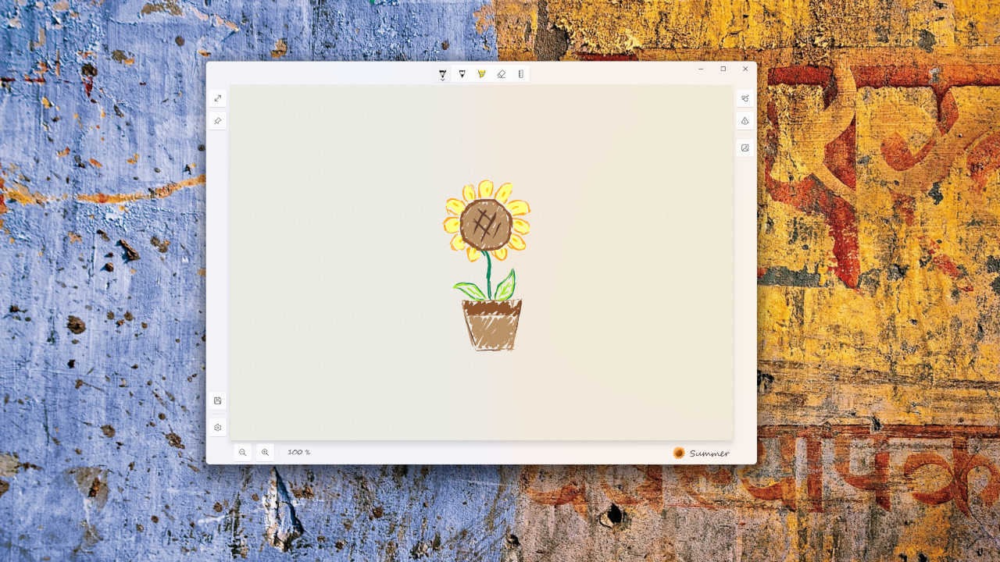

    

<h3 align="center">Summer，纯粹单一的草图画板</h3>

自从 Windows Ink 砍掉了草图功能后，我再也找不到一个可以临时画点东西的地方了。

欢迎使用暇墨，在这里，你可以恣意挥洒墨水，充分释放你的想象，绘制一幅惊人的杰作！好吧，这可能有些难度，毕竟这个软件目前的功能比较简单。但是它至少能够让你记下灵感瞬间，或者梳理思考过程，或者...画个简单的草图。

- 一个流畅简单的画板
- 支持多边形的识别
- 可以导入底图进行临摹
- 将你的作品保存为 PNG 文件

