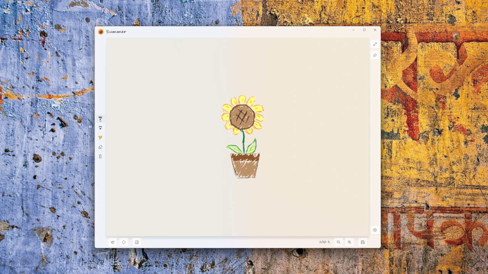

    

<h3 align="center">Summer Sketch</h3>
<h4 align="center">暇墨，干净的草图画板</h4>

## Overview

Welcome to Summer, where you can splash your ink as much as you want and fully unleash your imagination to draw an amazing masterpiece! Okay, that might be a bit difficult, after all, this software is rather simple at the moment. But it will at least allow you to jot down moments of inspiration, or comb through your thought process, or... draw a simple sketch.

欢迎使用暇墨，在这里，你可以恣意挥洒墨水，充分释放你的想象，绘制一幅惊人的杰作！好吧，这可能有些难度，毕竟这个软件目前的功能比较简单。但是它至少能够让你记下灵感瞬间，或者梳理思考过程，或者...画个简单的草图。

## Features

- A smooth and simple sketchpad
- Shape recognition for multiple forms
- Import background images for tracing
- Save your work as PNG files

- 一个流畅简单的画板
- 支持多种形状的识别
- 可以导入底图进行临摹
- 将你的作品保存为 PNG 文件

## Download

## Screenshots

